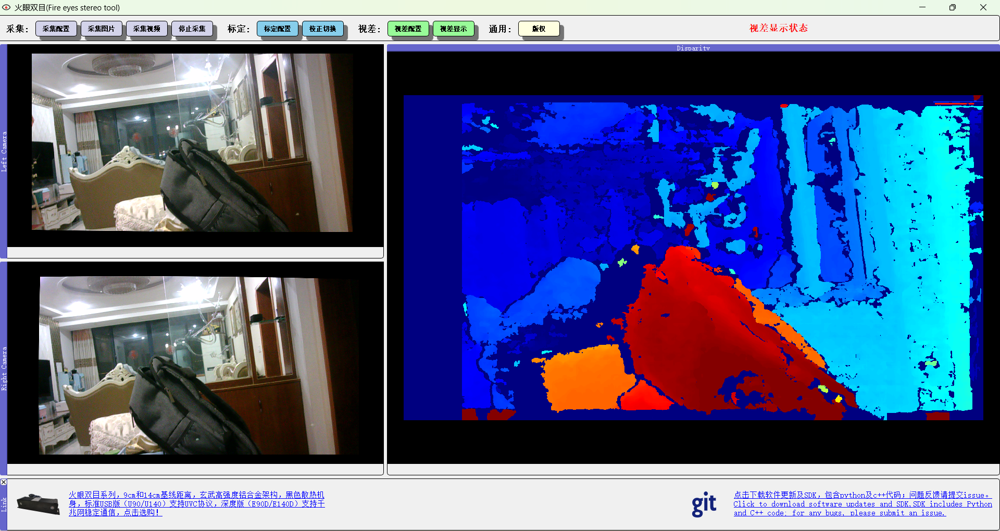
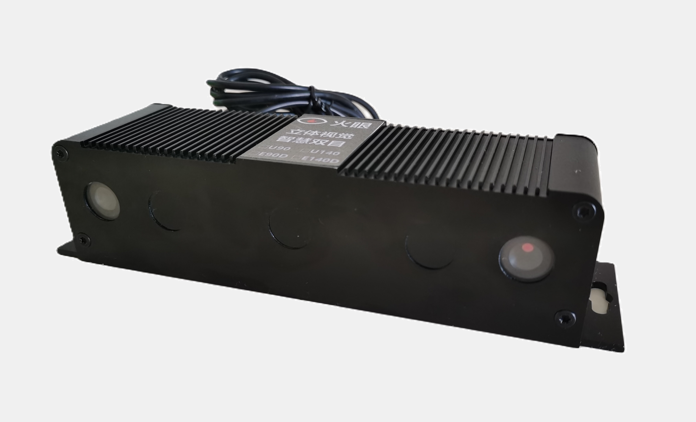

### FireEyesUsbSoftware,用于火眼双目的查看、采集、标定、视差生成工具软件，也可用于其他厂家USB接口的双目产品，欢迎Star
### It is a tool software for viewing, acquiring, calibrating, and generating disparity for FireEyes binoculars, and can also be used for binocular products from other manufacturers with USB interfaces.
for FireEyes U90/140
### 软件下载见右侧release

### 20240510 V2.1软件更新：
1.添加CSDN教程

2.优化标定部分代码

3.添加标定完成后，左右图拼接画线显示的功能（借用视差画布）

4.其他bug修复

### 软件下载见右侧release
StereoUsbGUI2_0更新内容一览：

1.支持双目可视化

2.支持数据采集（图片/视频）

3.支持双目标定（基于标定板），支持xml标定文件导出

4.支持双目视差计算及显示，包含SGBM及BM

StereoUsbGUI2_0 Update Contents Overview:

1.Supports binocular visualization

2.Supports data acquisition (images/videos)

3.Supports binocular calibration (based on a calibration board), supports exporting calibration files in XML format

4.Supports binocular disparity calculation and display, including SGBM and BM algorithms
